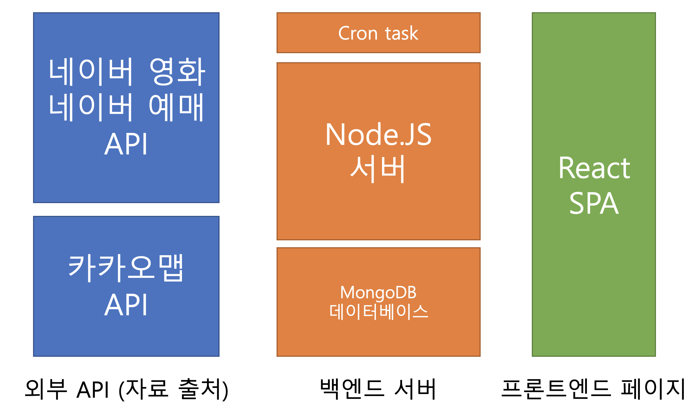

# hack-movie

제2회 싸국톤 프로젝트 (with [윤준혁](https://github.com/junhyeog))

## 프로젝트 내용
- 메가박스, CGV, 롯데시네마 등 영화관들의 상영시간을 한번에 조회하는 페이지
- 네이버 영화의 (비공식)API를 활용해 영화시간 수집

> 본 프로젝트는 학습용이며, 해당 API를 사용하는 데에 따르는 결과에는 개발자가 책임지지 않습니다.

## 프로젝트 구조



## Setup

```bash
npm run setup
```
### Configure API keys

```bash
echo 'KAKAO_KEY=foo' > backend/.env
```

## Run
### Development
```bash
npm run dev
```
### Production
```bash
npm run prod
```